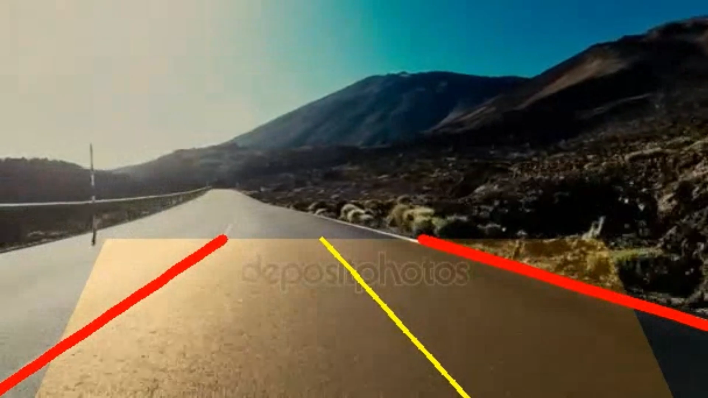

# 🚗 Lane Detection with OpenCV / OpenCV ile Şerit Tespiti

---

## 📌 Project Description / Proje Açıklaması

**EN:**  
This project detects lane lines in road videos using **Canny Edge Detection**, **Hough Transform**, and polynomial fitting.  
It includes an **EMA smoothing** method for stability and supports **slow-motion video recording** with lane overlays.

**TR:**  
Bu proje, yol videolarındaki şerit çizgilerini **Canny Kenar Algılama**, **Hough Transformu** ve polinom eğri uydurma yöntemleri ile tespit eder.  
Stabilizasyon için **EMA yumuşatma** yöntemi kullanır ve şerit çizimleri ile birlikte **yavaşlatılmış video kaydı** desteği sunar.

---

## ✨ Features / Özellikler

**EN:**
- Lane detection on both straight and curved roads  
- ROI (Region of Interest) masking  
- 1st or 2nd degree polynomial curve fitting  
- EMA smoothing for stability  
- Slow-motion recording and saving the processed video  

**TR:**
- Düz ve virajlı yollarda şerit tespiti  
- ROI (Region of Interest) maskesi  
- 1. veya 2. derece polinom eğri uydurma  
- Stabil görüntü için EMA yumuşatma  
- Yavaşlatılmış video kaydı ve işlenmiş video kaydetme  

---

## 📂 Project Structure / Proje Yapısı

lane-detection/
│
├─ src/
│  ├─ main.py       # Ana şerit tespit kodu
│
├─ data/
│  ├─ yol1.mp4                # Örnek video (küçük boyutlu veya link)
│  ├─ yol3.mp4                # Örnek video (küçük boyutlu veya link)
│
├─ screenshots/
│  ├─ sample_frame.png        # Çıktı görseli
|  ├─ sample_frame.png        # Çıktı görseli
|
├─ test_output/
│  ├─ output1.mp4        # Çıktı videosu
|  ├─ output2.mp4        # Çıktı videosu

├─ README.md
└─ .gitignore

